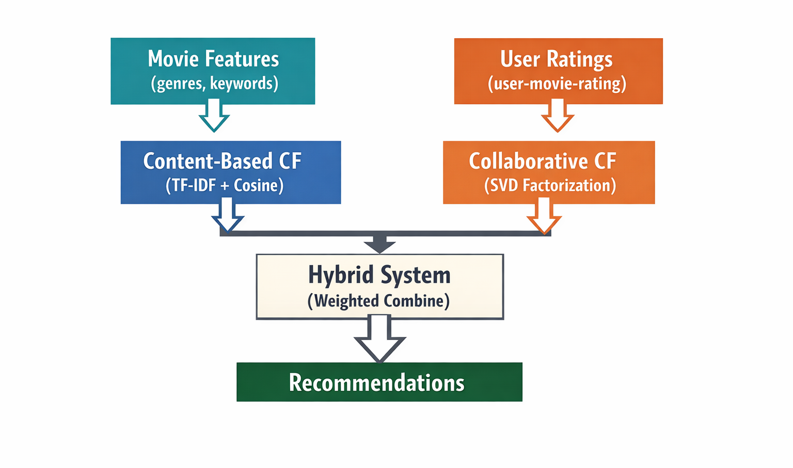

#  Movie Recommender System

A hybrid movie recommendation system that combines content-based filtering and collaborative filtering using machine learning techniques.



##  Project Overview

This project implements a hybrid movie recommender system that provides personalized movie recommendations by combining:

- **Content-Based Filtering**: Uses movie features (genres, keywords, plot) with TF-IDF vectorization and cosine similarity
- **Collaborative Filtering**: Uses user rating patterns with SVD (Singular Value Decomposition) matrix factorization
- **Hybrid Approach**: Combines both methods with weighted averaging (50% collaborative, 50% content-based)

The system is built with FastAPI and containerized with Docker for easy deployment.

---

##  System Architecture

The hybrid recommender system works as follows:

**Left Path (Content-Based):**
1. Movie features (genres, keywords, overview) are extracted
2. TF-IDF vectorization converts text to numerical vectors
3. Cosine similarity calculates movie-to-movie similarity
4. Returns movies similar to user's favorite

**Right Path (Collaborative):**
1. User-movie rating matrix is created from historical ratings
2. SVD factorization discovers hidden patterns in user preferences
3. Predicts ratings for unwatched movies
4. Returns top-rated predictions

**Hybrid System:**
- Takes 5 recommendations from content-based
- Takes 5 unique recommendations from collaborative
- Returns combined list of 10 movies

---

##  Technologies Used

- **Python 3.11**
- **FastAPI** - REST API framework
- **Pandas & NumPy** - Data manipulation
- **Scikit-learn** - TF-IDF vectorization and cosine similarity
- **SciPy** - SVD matrix factorization
- **Uvicorn** - ASGI server
- **Docker** - Containerization
- **Pydantic** - Data validation

---

##  Dataset

- **MovieLens 100K**: User ratings dataset
- **TMDB 5000 Movies**: Movie metadata (genres, keywords, cast, overview)
- **Final Dataset**: 387 movies with complete metadata and ratings from 943 users

---

##  Installation & Setup

### Prerequisites

- Python 3.11+
- Docker (optional, for containerized deployment)

---

### Option 1: Local Setup

#### 1. API Environment Setup
```bash
cd Api
python3 -m venv venv
source venv/bin/activate
pip install -r requirements.txt
```

#### 2. Module Environment Setup (for training/notebooks)
```bash
cd ../Module
python3 -m venv venv
source venv/bin/activate
pip install -r requirements.txt
```

#### 3. Run the FastAPI Server
```bash
cd ../Api
source venv/bin/activate
uvicorn Api:app --reload
```

The API will be available at: `http://127.0.0.1:8000`

Interactive API docs: `http://127.0.0.1:8000/docs`

---

### Option 2: Docker Setup

#### 1. Build Docker Image
```bash
cd Api
docker build -t movie-recommender .
```

#### 2. Run Docker Container
```bash
docker run -p 8000:8000 movie-recommender
```

The API will be available at: `http://127.0.0.1:8000`

---

##  API Endpoints

### 1. Health Check
```bash
GET /
```

**Response:**
```json
{
  "message": "Movie Recommender API"
}
```

---

### 2. Content-Based Recommendations
```bash
POST /recommend-by-movie
```

**Request:**
```json
{
  "title": "Toy Story"
}
```

**Response:**
```json
{
  "recommendations": [
    "Shrek",
    "Monsters Inc",
    "Finding Nemo",
    "Ice Age",
    "The Incredibles"
  ]
}
```

---

### 3. Collaborative Filtering Recommendations
```bash
POST /recommend-by-user
```

**Request:**
```json
{
  "user_id": 196
}
```

**Response:**
```json
{
  "recommendations": [
    "Good Will Hunting",
    "Grease",
    "Young Frankenstein",
    "Pretty Woman",
    "Glory"
  ]
}
```

---

### 4. Hybrid Recommendations
```bash
POST /recommend-hybrid
```

**Request:**
```json
{
  "user_id": 196,
  "title": "Toy Story"
}
```

**Response:**
```json
{
  "recommendations": [
    "Shrek",
    "Monsters Inc",
    "Finding Nemo",
    "Ice Age",
    "The Incredibles",
    "Good Will Hunting",
    "Grease",
    "Young Frankenstein",
    "Pretty Woman",
    "Glory"
  ],
  "content_based": 5,
  "collaborative": 5
}
```

---

##  Testing the API

### Using cURL
```bash
curl -X POST \
  'http://127.0.0.1:8000/recommend-hybrid' \
  -H 'Content-Type: application/json' \
  -d '{
    "user_id": 196,
    "title": "Toy Story"
  }'
```

### Using API Documentation

Visit `http://127.0.0.1:8000/docs` for interactive API documentation where you can test all endpoints directly in your browser.
